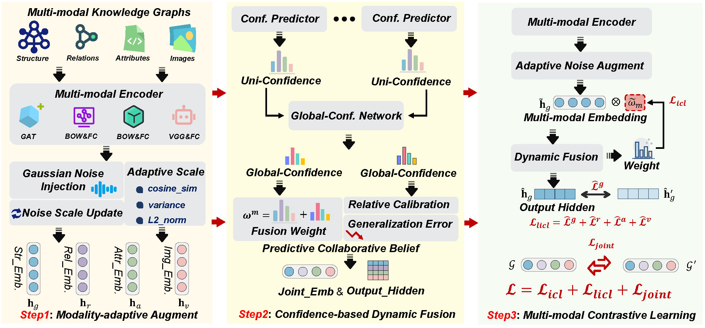

# NoCo: Noise-Augmented Multi-modal Entity Alignment with Confidence-based Dynamic Fusion

## Overview

<p align="center">
   
</p>
The overall framework of NoCo. (a) Modality-adaptive Augment: The multi-modal embedding is perturbed through a noise update mechanism
to fully leverage the representational capacity of the modal space. (b) Confidence-based Dynamic Fusion: Utilize confidence predictor and relative
calibration for multi-modal fusion. (c) Multi-modal Contrastive Learning: Utilize intra-modal contrastive loss to align multi-modal features.

## Dependencies
```bash
pip install -r requirement.txt
```
#### Details
- Python (>= 3.7)
- [PyTorch](http://pytorch.org/) (>= 1.6.0)
- numpy (>= 1.19.2)
- easydict (>= 1.10)
- unidecode (>= 1.3.6)
- tensorboard (>= 2.11.0)

## Train
- **Quick start**: Using  script file (`run.sh`)
```bash
>> cd NoCo
>> bash run.sh
```
- **Optional**: Using the `bash command`
```bash
>> cd NoCo
# Multi-OpenEA
>> bash run_noco.sh 1 OEA_EN_FR_15K_V1 norm 0.3 0
>> bash run_noco.sh 1 OEA_EN_DE_15K_V2 norm 0.3 0
>> bash run_noco.sh 1 OEA_D_W_15K_V1 norm 0.3 0
>> bash run_noco.sh 1 OEA_D_W_15K_V2 norm 0.3 0
# FBDB15K
>> bash run_noco.sh 1 FBDB15K norm 0.8 0 
>> bash run_noco.sh 1 FBDB15K norm 0.5 0 
>> bash run_noco.sh 1 FBDB15K norm 0.2 0 
# FBYG15K
>> bash run_noco.sh 1 FBYG15K norm 0.8 0 
>> bash run_noco.sh 1 FBYG15K norm 0.5 0 
>> bash run_noco.sh 1 FBYG15K norm 0.2 0
```
## Dataset
Download from [GoogleDrive](https://drive.google.com/file/d/1qweGZPvsqVOJf9ORs0kc8Eo2rCY7g3mM/view?usp=sharing) and unzip it to make those files **satisfy the following file hierarchy**:
```
ROOT
├── data
│   └── mmkg
└── code
    └── NoCo
```

